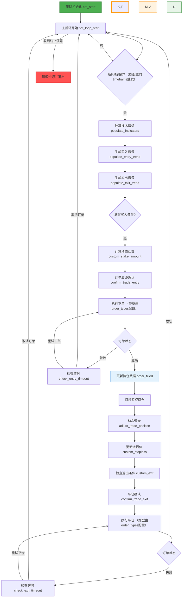

> 本文为 [https://www.itrade.icu](https://www.itrade.icu) 量化交易实验室出品。访问获取更多福利

访问获取更多福利


# 📘「揭秘」Freqtrade 策略全生命周期，教你打造稳定盈利的量化交易机器人！

Freqtrade 是一款开源的加密货币量化交易机器人，支持自动化策略执行、回测和实盘交易。理解其策略的完整生命周期，对于开发稳定且高效的量化策略至关重要。

本文将结合核心流程，逐步解读 Freqtrade 策略从启动到平仓的全流程，帮助你掌握策略运行的核心逻辑与关键节点。

---

## 策略生命周期概览

Freqtrade 的策略执行是一个有序的循环过程，主要围绕**K线周期触发、技术指标计算、买卖信号生成、订单执行与状态监控、持仓管理与平仓处理**展开。

以下伪代码简要描述了核心逻辑：

```python
while 策略运行中:
    if 有新K线:
        计算技术指标()
        生成买入信号()
        生成卖出信号()
        if 满足买入条件:
            计算仓位()
            确认并下单()
            检查买单状态()
            if 买单失败:
                重试或取消
            else:
                更新持仓
        if 持仓中:
            持仓动态管理()
            更新止损()
            检查卖出条件()
            if 满足卖出条件:
                确认并执行平仓
                检查卖单状态()
                if 卖单失败:
                    重试或取消
    else:
        等待下一周期
```

下面通过流程图，更直观地展示 Freqtrade 策略的执行流程：


---
## 标识符命名由来

| 标识符 | 含义              | 说明            |
| --- | --------------- | ------------- |
| K   | 买单状态检查（K线检查）    | 判断买入订单是否成交或失败 |
| T   | 卖单状态检查（Trade检查） | 判断卖出订单是否成交或失败 |
| M   | 买单失败处理（Missed）  | 处理买入订单失败或超时   |
| V   | 卖单失败处理（Voided）  | 处理卖出订单失败或超时   |
| L   | 买单成交回调（Long）    | 买入订单成交后触发回调   |
| U   | 卖单成交回调（Unwind）  | 卖出订单成交后触发回调   |

这些标识符仅用于简化流程图的表示，实际代码中需调用对应的策略函数，如 `order_filled()`。
---

## 关键节点详解

### 1. 策略初始化（bot\_start）

* 机器人启动时调用，负责初始化策略相关参数、环境和数据结构。
* 这一阶段为后续的交易循环提供基础保障，确保策略处于正确状态。

### 2. 主循环开始（bot\_loop\_start）

* 每根 K 线周期开始时触发，作为策略执行的节奏节点。
* 判断是否有新 K 线数据，确保所有计算和决策基于最新市场行情。

### 3. 技术指标计算（populate\_indicators）

* 计算所有自定义或内置的技术指标（如MA、RSI、MACD等）。
* 指标数据用于后续信号生成和策略判断。

### 4. 买卖信号生成（populate\_entry\_trend / populate\_exit\_trend）

* 根据指标和策略逻辑，判断是否满足买入或卖出条件。
* 买入信号触发买单流程，卖出信号用于持仓中的平仓判断。

### 5. 买入流程

* **计算动态仓位（custom\_stake\_amount）**
  根据账户余额、风险偏好和策略规则动态计算买入数量。

* **订单确认（confirm\_trade\_entry）**
  对订单价格和数量做最后确认。

* **执行下单（order\_types 配置决定限价或市价）**
  向交易所提交买单。

* **订单状态检测（节点K）**

  * 成功成交：更新持仓数据，触发 `order_filled` 回调。
  * 失败或超时：调用超时检查（check\_entry\_timeout），选择取消订单或重试下单。

### 6. 持仓监控

* 持仓期间，持续监控行情和仓位状态。
* 动态调整仓位（adjust\_trade\_position）、更新止损（custom\_stoploss）。
* 持续判断是否满足平仓条件（custom\_exit）。

### 7. 平仓流程

* **平仓确认（confirm\_trade\_exit）**
  确认平仓订单参数。

* **执行平仓（根据 order\_types 配置）**
  提交卖单进行平仓。

* **订单状态检测（节点T）**

  * 成功成交：更新持仓数据，回到主循环。
  * 失败或超时：调用超时检查（check\_exit\_timeout），重试或取消订单。

### 8. 循环与终止

* 每根新 K 线都触发以上流程，持续执行。
* 当策略收到终止信号时，执行资源清理和安全退出。

---


## 总结

Freqtrade 策略生命周期包含：

* **策略初始化**
* **行情驱动的技术指标和信号生成**
* **订单执行与状态管理（含重试机制）**
* **持仓动态管理和止损调整**
* **平仓及循环**
* **策略安全退出**

这一流程保证策略在自动化交易中具备良好的稳定性和灵活性，能够应对复杂多变的市场环境。

掌握此生命周期，能帮助你更有效地设计和优化量化策略，提高实盘表现。


