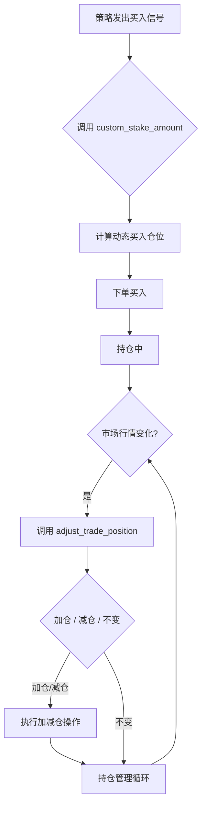

> 本文为 [https://www.itrade.icu](https://www.itrade.icu) 量化交易实验室出品。访问获取更多福利

访问获取更多福利


# 📘 智能仓位控制神器！Freqtrade 两大函数带你告别死板买入

在量化交易中，仓位管理是控制风险与提升收益的关键环节。  
Freqtrade 提供了两个强大且灵活的函数来帮助我们智能调整仓位：

- **`custom_stake_amount`**：动态计算每笔交易的买入仓位大小。  
- **`adjust_trade_position`**：根据市场和持仓状态，自动加仓或减仓。

本文将详细介绍这两个函数的功能、使用场景，并通过完整代码示例，帮你掌握智能控仓核心技巧。

---

## 🔍 一、custom_stake_amount：动态计算买入仓位

### 功能介绍

`custom_stake_amount` 允许策略动态计算本次买入所需资金或币量，替代配置文件中固定的 `stake_amount`。  
你可以根据行情趋势、账户余额、波动率等因素，灵活调整买入规模。

---

### 典型应用场景

| 场景                       | 说明                                          |
|----------------------------|-----------------------------------------------|
| 市场趋势强劲               | 增加买入资金，加大仓位                        |
| 市场震荡或趋势不明         | 减少买入资金，谨慎开仓                        |
| 账户资金变化               | 根据当前余额动态调整仓位                      |

---

### 函数签名示例

```python
def custom_stake_amount(self, pair: str, current_time: datetime, current_rate: float,
                        proposed_stake: float, min_stake: float, max_stake: float, **kwargs) -> float:
    """
    返回此次买入的实际金额
    """
```

---

### 📘 自定义仓位大小示例：根据账户余额动态调整投入比例

```python
    def custom_stake_amount(self, pair, current_time, current_rate, proposed_stake, min_stake, max_stake, **kwargs) -> float:
        """
        动态控制仓位大小：
        - 如果账户余额 > 1000 USDT，就投入 20%
        - 如果账户余额 < 100 USDT，只允许小额试探
        - 其他情况使用系统建议值
        """

        # 获取账户余额
        balance = self.wallets.get_total(self.config['stake_currency'])

        if balance > 1000:
            stake = min(balance * 0.2, max_stake)  # 投入最多20%
        elif balance < 100:
            stake = min_stake  # 只允许最低投入
        else:
            stake = proposed_stake  # 用默认建议

        print(f"[custom_stake_amount] 当前余额: {balance:.2f}, 设定仓位: {stake:.2f}")
        return stake
```

---

## 🔍 二、adjust_trade_position：持仓加减仓智能控制

### 功能介绍

`adjust_trade_position` 负责持仓期间的仓位调整，包括：

- 根据行情变化自动**加仓**  
- 识别风险信号及时**减仓**  
- 实现分批止盈或止损

---

### 典型应用场景

| 场景                     | 调整动作         | 说明                                     |
|--------------------------|------------------|------------------------------------------|
| 盈利超过设定阈值         | 加仓             | 抓住趋势加仓放大收益                    |
| 亏损超过预警阈值         | 减仓             | 控制风险，避免亏损扩大                  |
| 突发行情反转             | 部分平仓         | 保护利润，降低回撤                      |

---

### 函数签名示例

```python
def adjust_trade_position(self, trade: Trade, current_time: datetime, current_rate: float, **kwargs) -> float:
    """
    返回调整仓位的数量（正数加仓，负数减仓，0不变）
    """
```

---

### 代码示例：基于盈利/亏损比例加减仓

```python
def adjust_trade_position(self, trade, current_time, current_rate, **kwargs) -> float:
    profit_ratio = (current_rate - trade.open_rate) / trade.open_rate

    if profit_ratio > 0.05:
        # 盈利超5%，加仓10%
        add_amount = trade.amount * 0.1
        self.log(f"[adjust_trade_position] {trade.pair} 盈利5%以上，加仓 {add_amount} 单位")
        return add_amount

    if profit_ratio < -0.03:
        # 亏损超3%，减仓20%
        reduce_amount = -trade.amount * 0.2
        self.log(f"[adjust_trade_position] {trade.pair} 亏损3%以上，减仓 {abs(reduce_amount)} 单位")
        return reduce_amount

    return 0.0
```

---

## 📈 三、智能控仓流程示意图



## 🔔 四、使用建议与注意事项
- 边界限制：务必限制最小/最大买入金额，防止极端行情买入过小或过大。
- 风险控制：结合整体仓位比例，避免超配导致爆仓风险。
- 日志记录：记录每次仓位调整细节，方便回测调优。
- 测试覆盖：多场景回测确保逻辑稳健，防止策略过拟合。


## 5. 总结
`custom_stake_amount` 和 `adjust_trade_position` 是 Freqtrade 中实现智能仓位管理的两大法宝。
- `custom_stake_amount` 动态决定开仓资金投入，
- `adjust_trade_position` 实现持仓期间的加仓减仓操作。

合理运用它们，可以让你的策略更灵活，更符合市场实际，提升盈利同时控制风险。


