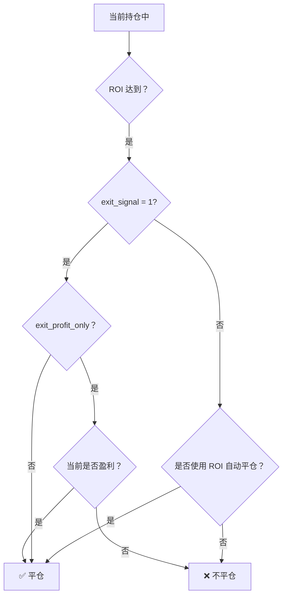

> 本文为 [https://www.itrade.icu](https://www.itrade.icu) 量化交易实验室出品。访问获取更多福利

访问获取更多福利


# 想加仓、减仓？Freqtrade 仓位调整机制一网打尽

在实际交易中，灵活调整仓位、实现多次分批买入卖出是提升收益和控制风险的重要手段。Freqtrade 支持动态仓位调整和多次入场机制，帮助策略实现加仓、减仓等进阶操作。本篇详细介绍相关参数及示例。

---

## ⚡ ignore_roi_if_entry_signal — 忽略 ROI，优先开仓信号
`ignore_roi_if_entry_signal` 控制当策略已持仓并再次发出买入信号时，是否忽略 `minimal_roi` 的止盈规则。启用后，策略在出现新入场信号时将忽略当前的 ROI 止盈设置，从而可能延长持仓时间。默认值为`False`。

+ 当该参数设置为 `True` 时：
  - 如果当前持仓中策略检测到新的入场信号，策略会忽略当前的 ROI 止盈限制。
  - 意味着即使 ROI 达到预设的止盈点，也不会立即卖出，而是等待新的入场信号。
  - 这样可以避免因ROI条件触发卖出，而错失后续更优的持仓机会。

+ 当该参数设置为 `False`（默认值）时：
  - 策略会严格按照 ROI 止盈设置执行。
  - 即使出现新的入场信号，只要 ROI 条件满足就会触发卖出。

```python
ignore_roi_if_entry_signal = True
```
使用场景：
- 适用于趋势策略、多段建仓；
- ROI 达标时不强制平仓，继续持仓等待更优机会。
#### ⚖️ 参数优先级逻辑图


## 🔄 position_adjustment_enable — 启用仓位调整功能
`position_adjustment_enable` 控制是否启用**自定义仓位调整功能**。

#### 代码示例
```python
position_adjustment_enable = True

def adjust_trade_position(self, trade, current_time, current_rate, current_profit, **kwargs) -> Optional[float]:
    """自定义加仓"""
    # 此处代码 无限加仓
    if current_profit > 0.10:	#	上涨10% 加仓
        # 加仓 10 USDT
        return 10.0
    return None


def adjust_trade_position(self, trade, current_time, current_rate, current_profit, **kwargs) -> Optional[float]:
    """自定义减仓"""
    if current_profit < -0.03:
        # 减仓 50%（负值表示减仓）
        current_stake = trade.stake_amount
        return -current_stake * 0.5
    return None

```
#### ⚠️注意事项
- 开启后，策略可以动态调整当前持仓的仓位大小
- 支持在持仓期间根据新的开仓信号进行加仓或减仓
- 必须与自定义函数 `adjust_trade_position()` 配合使用


## 📈 max_entry_position_adjustment — 最大加仓次数限制
```python
max_entry_position_adjustment = 3
```
- 限制每笔交易最大允许加仓（调整）次数，防止无限制加仓带来风险
- 根据策略和资金管理灵活设置，常见范围 1~5


## 🛠️ adjust_trade_position() 示例
该函数用于实现仓位的具体调整逻辑，比如判断当前持仓大小，决定是否加仓或减仓。

#### 代码示例
```python
def adjust_trade_position(self, trade, current_time, current_rate, current_profit, **kwargs) -> float:
    """
    返回值是调整后的仓位比例（0~1），比如 0.5 表示调整为50%仓位。

    示例逻辑：
    - 初始开仓为 30% 仓位
    - 每次满足加仓信号时，增加 20%
    - 最大仓位不超过 100%
    """
    current_position = trade.amount / trade.stake_amount if trade.stake_amount else 0

    # 假设有一个自定义信号判断是否加仓
    if self.should_add_position(trade, current_time):
        new_position = min(current_position + 0.2, 1.0)  # 加仓20%，最高100%
        return new_position
    else:
        return current_position  # 不调整
```
#### ⚠️注意事项
- 该方法由策略自动调用，用于动态调整仓位比例
- 可结合技术指标、当前盈利、市场情绪等多条件判断加减仓
- 返回值必须是0到1之间，代表调整后的目标仓位比例


## ✅ 总结清单
| 参数名                             | 功能描述               | 推荐默认值 / 说明        |
| ------------------------------- | ------------------ | ----------------- |
| `ignore_roi_if_entry_signal`    | 忽略 ROI 限制，优先响应开仓信号 | `True` 方便多次加仓     |
| `position_adjustment_enable`    | 启用仓位动态调整功能         | `True` 开启后需实现调整函数 |
| `max_entry_position_adjustment` | 每笔交易最大加仓次数限制       | `3` 具体根据策略风险管理调整  |
| `adjust_trade_position()`       | 自定义仓位调整逻辑函数        | 需实现并返回目标仓位比例      |


